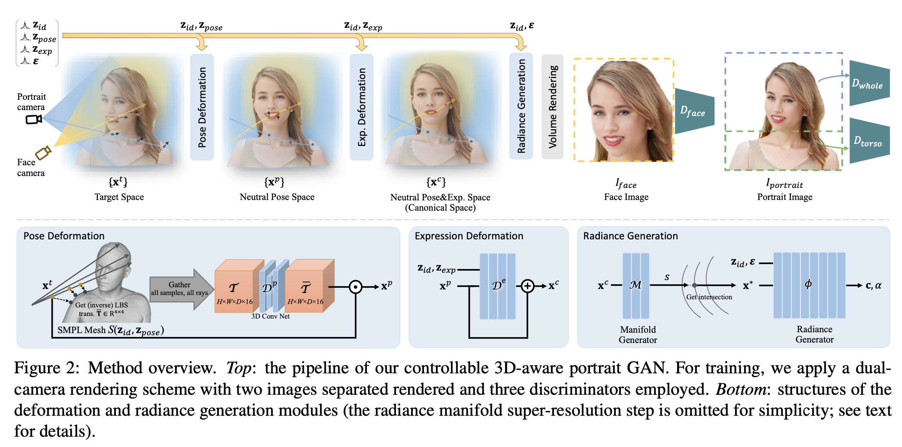
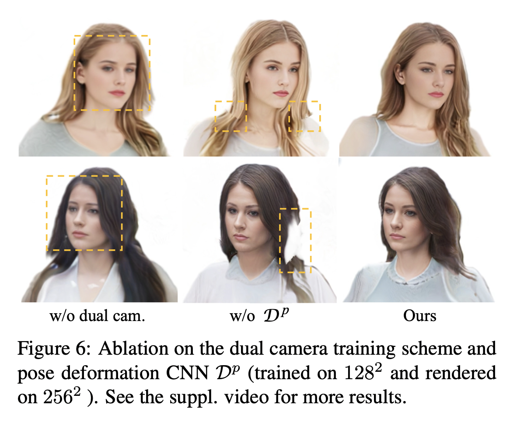

## AniPortraitGAN: Animatable 3D Portrait Generation from 2D Image Collections
[[paper](https://arxiv.org/pdf/2309.02186.pdf)] [[project page](https://yuewuhkust.github.io/AniPortraitGAN/)] [[code](https://github.com/YueWuHKUST/AniPortraitGAN)]

### Task
- Learn a 3D-aware GAN model to generate portraits that include upper body.

### Method

- Main idea
  - For each query point sampled from the rays:
    observed space -> neutral pose space -> neutral expression space -> color & opacity
  - Then carry out volumetric rendering to get a low-resolution generation.
  - Finally adopt a super-resolution block to get a high-resolution synthesis.
- From observed space -> neutral pose space
  - For each point, find its nearest point on the SMPL mesh to obtain a transformation matrix that can map the point back to the neutral pose space.
  - **To facilitate deformation learning, they propose to gather the transformation matrices of all query points and feed it through a 3D ConvNet.** This will produce more consistent deformation, especially for the hair area.
    
- From neutral pose space -> neutral expression space
  - Learn an MLP that takes the identity code and expression code as inputs, and output the displacement that maps the point to its correspondence in the canonical space.
- The canonical space
  - For each point in the canonical space, learn an MLP to predict its color and opacity.
  - They follow the [GRAM paper](https://github.com/microsoft/GRAM) formulation.

### Training
- Dual camera
  - One camera to render the face region, another to render the full upper body. Apply different discriminators for different renderings.
- Learn the 3D part first, then learn the super-resolution block from scratch while freezing the 3D part. 
