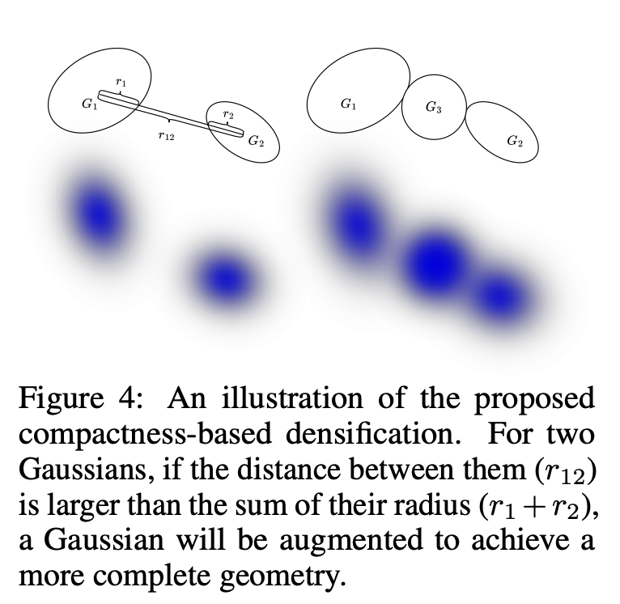
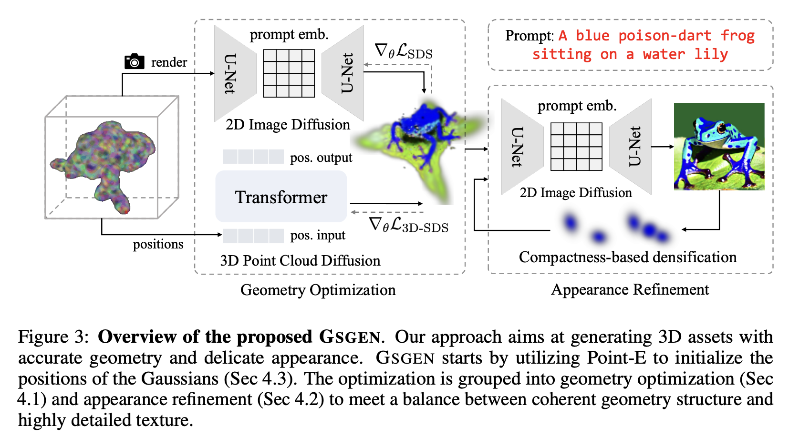

# Text-to-3D using Gaussian Splatting
[[paper](https://arxiv.org/abs/2309.16585)] [[code](https://github.com/gsgen3d/gsgen)] [[project page](https://gsgen3d.github.io)]

## Task
- Text to 3D with diffusion guidance, using 3D Gaussians as representation.

## Main idea
- Point-E utilization
  - Initialize the geometry of the 3D Gaussians.
  - Provide SDS loss to resolve Janus project.
  - The color produced by Point-E cannot be used in both initialization or the SDS loss.
- Compactness Densification
  
  - Instead of using the gradient magnitude to see if new Gaussians need to be produced, this paper uses a heuristic manner.
  - Given two Gaussians G1 and G2 and their radius r1 and r2, their distance r12. If r12 > (r1 + r2), then add a Gaussian between G1 and G2.

## Framework

- Initialization.
  - Get a point cloud by Point-E, only point positions are used.
- Stage I.
  - Optimize the initialized 3D Gaussians by 2D SDS loss from stable diffusion, and 3D SDS loss from Point-E.
- Stage II.
  - Optimize the 3D Gaussians by 2D SDS loss with the compactness densification process.

## TL;DR
- Point-E can be used to resolve the Janus problem when using 3D Gaussian as representation.
- The compactness densification process seems more robust than the native densification process in the Gaussian Splatting paper.
