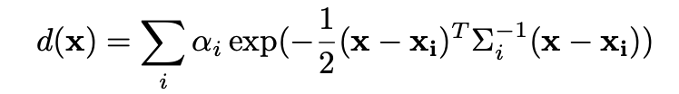

# DreamGaussian: Generative Gaussian Splatting for Efficient 3D Content Creation
[[paper](https://arxiv.org/abs/2309.16653)] [[code](https://github.com/dreamgaussian/dreamgaussian)] [[project page](https://dreamgaussian.github.io/)]

## Task
- Text/image to 3D, using 3D Gaussians as the geometry representation.

## Main Novelty
- Proposed an algorithm to extract textured meshes from 3D Gaussians.

## Framework

- 3D Gaussians initialization.
  - Randomly sample points inside a sphere.
  - Start with just few Gaussians (1000 for text-to-3D, 5000 for image-to-3D) and densify frequently.
  - Use RGB instead of spherical harmonics.
- Stage I.
  - Optimize with Zero-123-XL or CLIP guidance.
- Mesh extraction.
  - Split the 3D space in range (-1,1) to a 16*16*16 grid.
  - For each block, further divide it to a 8*8*8 blocks.
  - Accumulate the density of all Gaussians falling into each smaller block by

    

  - This will produce a 128*128*128 density grid. Then apply marching cubes to extract the final mesh.
- Texture UV extraction.
  - Render the 3D Gaussians from Stage I at a set of pre-defined views.
  - Back-project pixels from these views onto the UV texture.
- Stage II.
  - Render a coarse RGB from the textured mesh.
  - Denoise it to get a fine RGB image.
  - Use the fine RGB image as sudo supervision by:

    

## TL;DR
- A algorithm to extract a mesh from 3D Gaussians.
  
