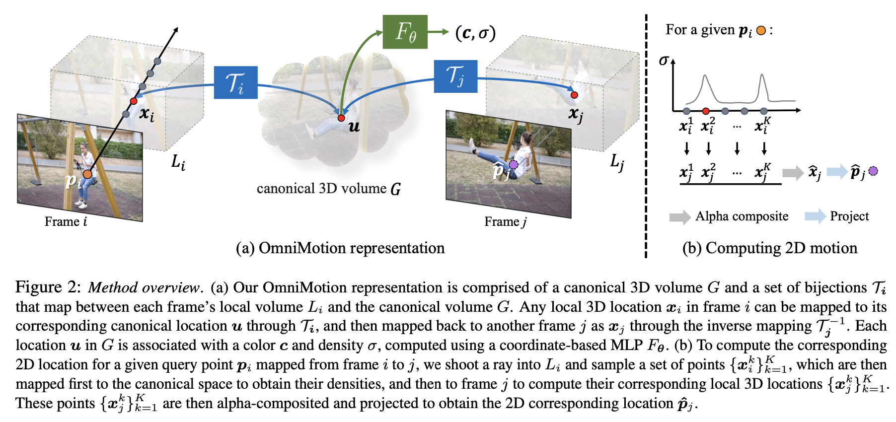
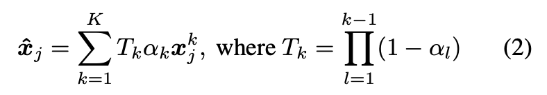

# Tracking Everything Everywhere All at Once

[[paper](https://arxiv.org/abs/2306.05422)] [[code](https://github.com/qianqianwang68/omnimotion)] [[project page](https://omnimotion.github.io/)]

## Task
- Learn dense and long-range pixel correspondence from a single video.

## Main Idea
- Represent the video as:
  - A quasi-3D canonical volume.
  - And a canonical-local volume bijective mapping function for all pixels.

## Framework

### Canonical Volume
- The canonical volume is represented by an implicit function: $u\rightarrow F_{\theta} \rightarrow (\sigma, c)$
- Intuitively, for each 3D point $u$, it predicts an opacity $\sigma$ and a color $c$.

## Bijective Local-canonical Mapping
- The goal of this module is to map any point $x_i$ from the local volume at timestep $i$ to the canonical space.
- This is implemented as an INN (Invertible Neural Network): $u = \tau_i(x_i)$.
- So that a point $x_i$ from timestep $i$ can be mapped to timestep $j$ by: $x_j = \tau_j^{-1} \circ \tau_i(x_i).$
- To share on INN across time, the paper learns an INN $M$ conditioned on a per-timestep latent code $\Phi_i$ such that $u=M(x_i;\Phi_i)$.

## Pixel-to-pixel matching
- To find the correspondence of pixel $p_i$ in timestep $i$ in timestep $j$:
  - First shoot a ray from orthographic camera, i.e., the ray is perpendicular to the image plane, this is under the assumption that camera motion and scene motion is entangled.
  - Then sample $K$ points on the ray denoted as $\{x_i^k}$, mapping all these points to timestep $j$ by the method discussed above. At the same time, the color and opacity of these points can be computed as $F_{\theta}(M(x_i^k, \Phi_i))$.
  - The corresponding 3D point of $p_i$ is computed as:

    
  - Finally, the corresponding pixel $p_j$ can be obtained by orthographically projecting $\hat{x}_j$ onto the image plane.

### Loss Functions
- Flow supervision (optical flow has been heuristically cleaned):
- RGB supervision
- Regularization
  - Penalize large change in nearby timestep.

## TL;DR
- Use dynamic quasi-3D to model video motion. The benefits are:
  - The canonical volume essentially acts as a "storage" of all pixels. Thus pixels won't get lost when they are occluded in some timesteps. It also acts as a soft constraint by sharing the canonical volume across timesteps.
  - The depth of volume representation encodes the spatial relationship of all pixels, which also helps handling occlusion.
  - The bijective mapping is 3D, thus it models motion in the z-axis as well.
